---

## whoami

### `AmirReza Rashidi` · `TokyoHunter`

**Computer Engineering Student** &nbsp;·&nbsp; Iran

Offensive Security · Bug Hunting · Penetration Testing

*Open to junior cybersec roles — 2026*

| | |
|:---:|:---|
|  | [@weareunity5831](https://t.me/weareunity5831) |
|  | amirrezarashidi5831ar@gmail.com |
|  | [github.com/TokyoHunter](https://github.com/TokyoHunter) |

---

## skills

#### security & tools

#### languages

#### platforms

---

## owasp 1000h

---

## stats

---

