<div align="center">



</div>

---

```json
{
  "handle"  : "TokyoHunter",
  "name"    : "AmirReza Rashidi",
  "role"    : "Computer Engineering Student",
  "target"  : "Security Research & Penetration Testing",
  "status"  : "open to junior cybersec roles — 2026"
}
```

---

## skills

```
Linux & Shell        ████████░░  80%
Reconnaissance       ████████░░  80%
Networking           ███████░░░  70%
Web Exploitation     ██████░░░░  60%
OWASP Methodology    ██████░░░░  60%
Bug Bounty           ████░░░░░░  40%
Python               ███░░░░░░░  30%
```

---

## owasp 1000h challenge

```
░░░░░░░░░░░░░░░░░░░░░░░░░░░░░░░░  progress
████░░░░░░░░░░░░░░░░░░░░░░░░░░░░  250 / 1000 hrs  [25%]
```

---

## labs

| platform | status |
|---|---|
| PortSwigger Web Security | 🟢 active |
| Hack The Box | 🟢 active |
| OWASP Labs | 🟢 active |

---

## log

```diff
+ OWASP Top 10 completed
+ PortSwigger labs solved
+ HTB machines compromised
+ first verified vulnerability reported
+ appointed teaching assistant
- bug bounty reward         [pending]
- security research paper   [pending]
```

---

## stats

<div align="center">


</div>

---

```
email     → amirrezarashidi5831ar@gmail.com
telegram  → @weareunity5831
github    → github.com/TokyoHunter
```
